# Architecture Overview

Visual representation and detailed explanation of the Angular 20 + Nx monorepo architecture with dependency relationships and design patterns.

## 🏗️ System Architecture Diagram

```mermaid
graph TB
    subgraph "Apps Layer"
        A1[Admin App<br/>User Management<br/>Settings]
        A2[Lab App<br/>Experiments<br/>Reports]
        A3[Billing App<br/>Products<br/>Invoices]
    end

    subgraph "Infrastructure Libraries"
        C1[Core<br/>• Interceptors<br/>• Guards<br/>• Services<br/>• Error Handling]
        A4[Auth<br/>• JWT Tokens<br/>• Role Guards<br/>• Session Mgmt]
        ST1[Styles<br/>• Design Tokens<br/>• Themes<br/>• SCSS Utils]
    end

    subgraph "Shared Libraries"
        S1[Shared UI<br/>• Components<br/>• Directives<br/>• Pipes]
        S2[Utils<br/>• Date Helpers<br/>• String Utils<br/>• RxJS Operators]
        I1[Interfaces<br/>• Type Definitions<br/>• DTOs<br/>• Models]
        I2[i18n<br/>• Translations<br/>• Localization]
    end

    subgraph "State Management"
        ST2[Global State<br/>• User Store<br/>• Theme Store<br/>• Notifications]
    end

    subgraph "Feature Libraries"
        F1[Admin Features<br/>• Users<br/>• Roles<br/>• Audit]
        F2[Lab Features<br/>• Experiments<br/>• Reports]
        F3[Billing Features<br/>• Products<br/>• Invoices<br/>• Reports]
    end

    subgraph "External Services"
        API[REST API<br/>Backend Services]
        AUTH[Auth Provider<br/>OAuth/OIDC]
        CDN[CDN<br/>Static Assets]
    end

    %% App dependencies
    A1 --> C1
    A1 --> A4
    A1 --> S1
    A1 --> ST1
    A1 --> ST2
    A1 --> F1

    A2 --> C1
    A2 --> A4
    A2 --> S1
    A2 --> ST1
    A2 --> ST2
    A2 --> F2

    A3 --> C1
    A3 --> A4
    A3 --> S1
    A3 --> ST1
    A3 --> ST2
    A3 --> F3

    %% Feature dependencies
    F1 --> S1
    F1 --> C1
    F1 --> ST2
    F1 --> I1

    F2 --> S1
    F2 --> C1
    F2 --> ST2
    F2 --> I1

    F3 --> S1
    F3 --> C1
    F3 --> ST2
    F3 --> I1

    %% Infrastructure dependencies
    C1 --> S2
    A4 --> C1
    A4 --> I1

    %% Shared dependencies
    S1 --> ST1
    S1 --> I2

    %% External connections
    C1 -.-> API
    A4 -.-> AUTH
    ST1 -.-> CDN

    %% Styling
    classDef appLayer fill:#e1f5fe
    classDef infraLayer fill:#f3e5f5
    classDef sharedLayer fill:#e8f5e8
    classDef stateLayer fill:#fff3e0
    classDef featureLayer fill:#fce4ec
    classDef externalLayer fill:#f5f5f5

    class A1,A2,A3 appLayer
    class C1,A4,ST1 infraLayer
    class S1,S2,I1,I2 sharedLayer
    class ST2 stateLayer
    class F1,F2,F3 featureLayer
    class API,AUTH,CDN externalLayer
```



## 📋 Layer Descriptions

### 🔷 Apps Layer (Blue)

**Entry points for different business domains**

- **Admin App**: User management, system settings, audit logs
- **Lab App**: Laboratory management, experiments, sample tracking
- **Billing App**: Product management, invoicing, payment processing

Each app is a standalone Angular application with its own routing and layout components.

### 🔷 Infrastructure Layer (Purple)

**Core system services and cross-cutting concerns**

- **Core**: HTTP interceptors, error handlers, guards, logging
- **Auth**: Authentication, authorization, JWT token management
- **Styles**: Design system, themes, SCSS utilities

These libraries provide foundational services used across all applications.

### 🔷 Shared Layer (Green)

**Reusable components and utilities**

- **Shared UI**: Dumb components, directives, pipes
- **Utils**: Pure utility functions for common operations
- **Interfaces**: TypeScript type definitions and DTOs
- **i18n**: Translation files and localization utilities

Pure, stateless libraries that can be safely imported by any other layer.

### 🔷 State Layer (Orange)

**Global application state**

- **User Store**: Current user, authentication state
- **Theme Store**: Current theme, preferences
- **Notification Store**: Global notifications, alerts

Centralized state management using Angular Signals.

### 🔷 Feature Layer (Pink)

**Domain-specific business logic**

- **Admin Features**: User CRUD, role management, audit trails
- **Lab Features**: Experiment management, result analysis
- **Billing Features**: Product catalog, invoice generation

Each feature module encapsulates related components, services, and state.

### 🔷 External Layer (Gray)

**External services and APIs**

- **REST API**: Backend data services
- **Auth Provider**: OAuth/OIDC authentication
- **CDN**: Static asset delivery

External dependencies accessed through the infrastructure layer.

---

## 🔄 Data Flow Patterns

### User Authentication Flow


### Feature Data Loading


---

## 🎯 Dependency Rules

### ✅ Allowed Dependencies

```
Apps → Infrastructure, Shared, State, Features
Features → Infrastructure, Shared, State, Interfaces
Infrastructure → Shared (Utils only)
Shared → None (except Styles for UI components)
State → Infrastructure, Interfaces
```

### ❌ Prohibited Dependencies

```
Shared → Features (breaks reusability)
Infrastructure → Features (creates coupling)
Features → Apps (wrong direction)
Circular dependencies between any layers
```

---

## 🏗️ Component Architecture

### Container/Presentation Pattern


### State Management Flow


---

## 🎨 Design System Architecture

### Theme System Hierarchy


---

## 🔐 Security Architecture

### Authentication & Authorization Layers


---

## 📊 Performance Architecture

### Bundle Optimization Strategy


---

## 🚀 Deployment Architecture

### Multi-Environment Strategy


---

## 📐 Architectural Principles

### 1. **Separation of Concerns**

Each layer has a specific responsibility and doesn't overlap with others.

### 2. **Dependency Inversion**

High-level modules don't depend on low-level modules. Both depend on abstractions.

### 3. **Single Responsibility**

Each library, service, and component has one reason to change.

### 4. **Open/Closed Principle**

Open for extension, closed for modification through interfaces and dependency injection.

### 5. **Interface Segregation**

Clients shouldn't depend on interfaces they don't use.

### 6. **DRY (Don't Repeat Yourself)**

Common functionality is abstracted into shared libraries.

### 7. **SOLID Principles**

All SOLID principles are applied throughout the architecture.

---

## 🎯 Architecture Benefits

### ✅ **Scalability**

- Easy to add new apps and features
- Clear separation of concerns
- Modular architecture

### ✅ **Maintainability**

- Dependency boundaries prevent coupling
- Shared libraries reduce duplication
- Clear architectural layers

### ✅ **Testability**

- Services and components are easily mockable
- Clear dependencies make testing straightforward
- Separation of smart/dumb components

### ✅ **Performance**

- Lazy loading and code splitting
- Tree shaking removes unused code
- Optimized bundle strategies

### ✅ **Developer Experience**

- Consistent patterns across the codebase
- Clear guidelines for adding new features
- Strong TypeScript integration

This architecture provides a solid foundation for building large-scale Angular applications while maintaining code quality, performance, and developer productivity.
